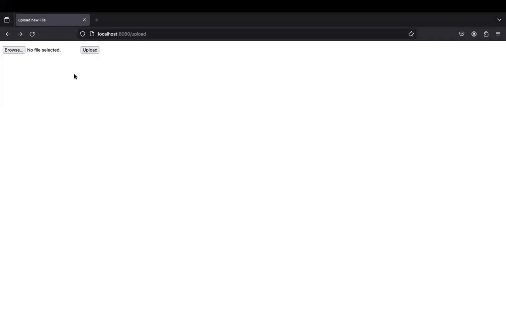

# Flask on Docker with Postgres, Nginx, and Gunicorn

## Overview
This repository is a step-by-step guide on how to containerize a Flask application for development with Docker and Postgres. For production environments, it further integrates Nginx and Gunicorn for enhanced performance and security. This setup also includes handling of static and user-uploaded media files via Nginx, making it a comprehensive solution for deploying Python web applications.



Note: The gif above demonstrates the process of uploading an image to the application, showcasing ease of use and functionality.

Project Setup
To get started, clone the repository and navigate into the project directory:

```
$ git clone <repo url>
$ cd flask-on-docker
```

## Build Instructions
- Environment Setup: Ensure Docker and Docker Compose are installed on your system.

- Build and Run Containers:

For development:

```
$ docker-compose up --build
```

For production:

```
$ docker-compose -f docker-compose.prod.yml up --build -d
```

- Initialize the Database:

After starting the containers, initialize the database:

```
docker-compose exec web python manage.py create_db
```

For seeding the database with initial data:

```
docker-compose exec web python manage.py seed_db
```

- Accessing the Application:

Development: Navigate to http://localhost:8080/ to view the application.

Production: Navigate to http://localhost:8080/ to view the application through Nginx.

Note: Port forwarding maybe required depending on permissions.


